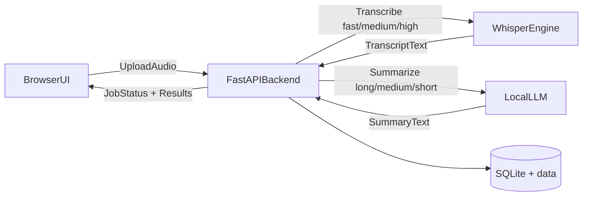

# План реализации офлайн Whisper-приложения

## 1) Архитектура (offline-first)
- `Frontend (browser UI)`:
  - drag-and-drop загрузка аудио
  - выбор модели транскрибации: `fast` / `medium` / `high`
  - выбор длины саммари: `long` / `medium` / `short`
  - отображение прогресса, текста транскрипта и итогового саммари
- `Backend (FastAPI)`:
  - endpoint загрузки файла и запуска пайплайна
  - модуль транскрибации (Whisper)
  - модуль саммаризации (локальная LLM)
  - очередь задач + статус (чтобы UI не зависал)
- `Inference engines (локально)`:
  - ASR: `faster-whisper` (CTranslate2)
  - LLM: `Ollama` (локальный inference, без интернета после загрузки моделей)
- `Storage`:
  - локальная директория `data/` для входных файлов и результатов
  - SQLite для метаданных задач (статусы, длительность, выбранные параметры)

## 2) Выбор моделей и рекомендации по качеству
- **Whisper (ASR)**:
  - `fast` (рекомендуемый маппинг: `small`) = максимально быстро, ниже точность на шуме/акцентах
  - `medium` = быстрее, чуть ниже точность
  - `high` (рекомендуемый маппинг: `large-v3`) = выше точность, больше время/память
- **LLM для саммари (локально, качественно на M-серии)**:
  - основной вариант: `qwen2.5:14b-instruct-q4_K_M` (лучший баланс качества для структурных саммари)
  - альтернативы:
    - `llama3.1:8b-instruct-q4_K_M` (быстрее, ниже глубина)
    - `mistral-nemo:12b-instruct-q4_K_M` (хороший компромисс)
- **Почему так**:
  - при 64 GB RAM на Apple Silicon можно уверенно запускать 12–14B квантованные модели локально
  - качество саммари у 12–14B заметно выше на длинных транскриптах, чем у 7–8B

## 3) Контракты API и UX
- `POST /jobs`:
  - multipart: `audio_file`, `asr_model` (`fast|medium|high`), `summary_size` (`long|medium|short`)
  - ответ: `job_id`
- `GET /jobs/{job_id}`:
  - статус: `queued|processing|done|error`
  - прогресс этапов: upload, asr, summarize
- `GET /jobs/{job_id}/result`:
  - `transcript`, `summary`, `timings`, `model_info`
- UX best practices:
  - ограничения форматов (`wav/mp3/m4a/flac`) и размера
  - явная индикация времени этапов
  - кнопка «скопировать транскрипт/саммари»
  - отображение предупреждений (длинный файл, нехватка RAM, таймаут)

## 4) Реализация пайплайна обработки
- Шаг ASR:
  - нормализация аудио (ffmpeg, mono 16k)
  - выбор compute settings для Apple Silicon (`float16`/`int8_float16`, batch tuning)
  - сегментная транскрибация с объединением результата
- Шаг Summarization:
  - шаблоны промптов под длину:
    - `short`: 5–7 буллетов
    - `medium`: 2–4 абзаца + action items
    - `long`: подробный конспект по разделам
  - для длинных транскриптов: `map-reduce` саммаризация (chunk -> partial summary -> final summary)
- Надежность:
  - job timeout, retry 1 раз на summarize
  - graceful error messages
  - сохранение промежуточных артефактов

## 5) Offline и безопасность
- Полное отсутствие внешних API в runtime
- Локальная модельная директория + lock версий
- Локальные логи без отправки телеметрии
- Валидация входных файлов и sanitization имен
- Ограничение одновременных задач (например, 1–2 параллельно)

## 6) Тестирование и критерии готовности
- Unit:
  - валидация параметров (`fast|medium|high`, `long|medium|short`)
  - маппинг промптов и chunking
- Integration:
  - E2E: загрузка файла -> транскрипт -> саммари
  - тест на длинный файл (30–60 мин) и стабильность памяти
- Acceptance критерии:
  - работает без интернета после первичной установки
  - корректно обрабатывает минимум 3 формата аудио
  - стабильное создание саммари всех 3 режимов длины

## 7) План внедрения по этапам
- Этап 1 (MVP):
  - upload UI, ASR fast/medium/high, базовый summary-size, один job worker
- Этап 2 (качество):
  - map-reduce summarization, улучшенные промпты, отчеты по timing
- Этап 3 (продакшн-локально):
  - усиление ошибок/логов, оптимизация памяти, упаковка в один запускной скрипт

## 8) Практические best practices для твоего железа (Mac Apple Silicon)
- использовать `faster-whisper` вместо Python-оригинала Whisper для скорости
- держать 1 ASR job одновременно + 1 summarize job максимум
- для длинных файлов включать VAD и chunking
- использовать `q4_K_M` квантование для LLM как баланс качества/скорости
- хранить готовые транскрипты и summary как кэш, чтобы не пересчитывать